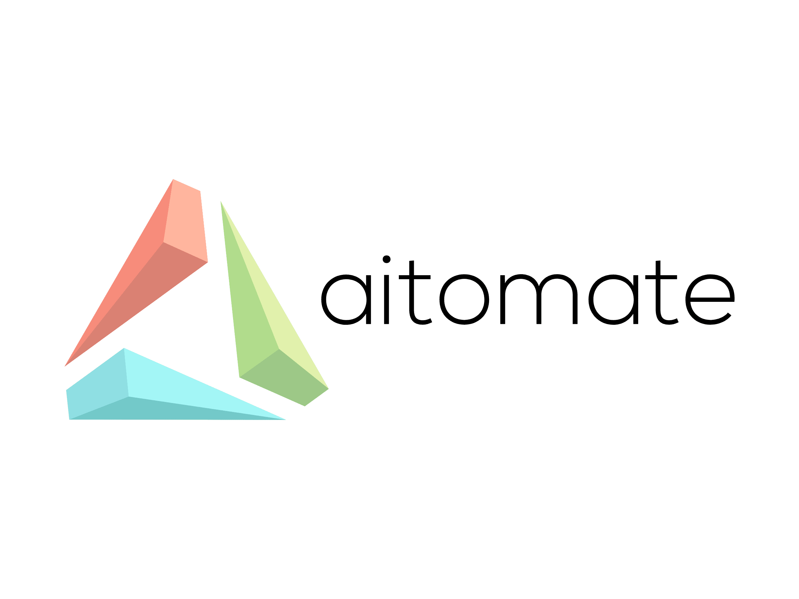

# Description
Automation of business-specific processes involves using technology to streamline and optimize tasks within a company's workflows. This can include a wide range of activities, from automating routine administrative tasks to optimizing complex production processes.

One example of a business-specific process that can be automated is customer relationship management (CRM). This involves tracking and managing customer interactions, including phone calls, emails, and social media interactions. By automating CRM tasks, companies can free up staff time for more valuable work and improve the accuracy and consistency of customer data.

Another example of a business-specific process that can be automated is financial reporting. Financial reporting involves generating financial statements and other reports that provide insight into a company's financial health. By automating financial reporting, companies can reduce the risk of errors and save time and effort in the reporting process.

In manufacturing, automation can be used to optimize production processes, including assembly line operations, inventory management, and quality control. By automating these processes, companies can increase efficiency, reduce errors, and improve product quality.

Overall, automation of business-specific processes can bring many benefits, including cost savings, improved accuracy, increased efficiency, and more time for staff to focus on higher-value work.

**aitomate.ai** is here to automate any process within your business with help of artificial inteligence and state of art configuration system!

Copyright © aitomate.ai. All rights reserved.

